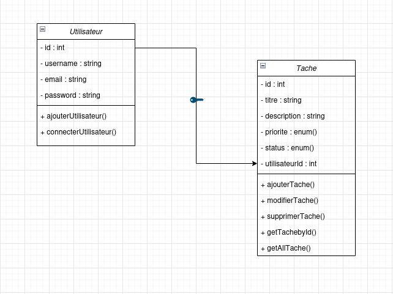

# 🗂️ Gestionnaire de Tâches — Projet CRUD  

---

## 📋 Description  

Ce projet est une application web de **gestion de tâches (CRUD)** permettant d’ajouter, modifier, supprimer et afficher des tâches.  

Elle a été développée dans le cadre d’un projet de classe afin de mettre en pratique la programmation et la gestion des projets.  

---

## ⚙️ Fonctionnalités principales  

- ➕ Ajouter une nouvelle tâche  

- 📝 Modifier une tâche existante  

- 🗑️ Supprimer une tâche  

- 👀 Consulter la liste des tâches  

- 💾 Sauvegarde des données dans une base **MySQL**  

---

## 🛠️ Technologies utilisées  

| Technologie | Description |
|--------------|-------------|
| **HTML5** | Structure du site |
| **CSS3** | Mise en forme et design |
| **JavaScript** | Interactions dynamiques |
| **PHP** | Logique côté serveur |
| **MySQL** | Base de données |

---

## 📊 Diagramme UML  

Voici le diagramme UML du projet :  

---

## 👨‍💻 Contributeurs  

👥 **Équipe du projet :**  

- YASSINE  

- HAITHAM  

- BAKR  

- ADAM  

- HAMZA  

- OTHMAN  

---

## 📄 Licence  

Ce projet est distribué sous la **licence MIT**. 
